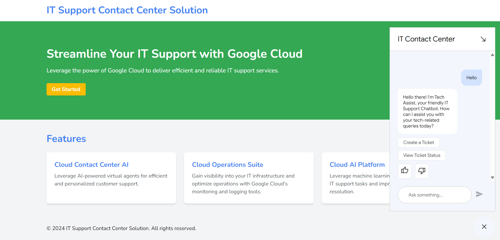
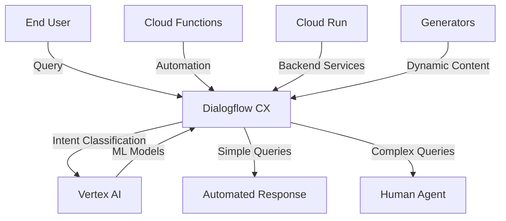

# 🤖 IT Support Contact Center Solution 🛠️

[](https://cloud.google.com/)
[](https://cloud.google.com/dialogflow)
[](https://flask.palletsprojects.com/)

## 📋 Overview

This project leverages Google Cloud technologies to create a robust and scalable IT support contact center solution. The proposed architecture utilizes Dialog Flow CX, Vertex AI, Generators, Cloud Run, and Cloud Functions to deliver an efficient and user-friendly experience for both IT support agents and end-users.



## 🏗️ Architecture



## 🧩 Components

| Component | Description | Key Features |
|-----------|-------------|-------------|
| 🎯 **Dialogflow CX** | A conversational AI platform that handles user inquiries through a virtual agent. | • Text & voice interaction<br>• Natural language understanding<br>• Multi-language support |
| 🧠 **Vertex AI** | A unified platform for machine learning used to build and deploy various AI models for the contact center. | • Intent classification<br>• Entity recognition<br>• Sentiment analysis |
| 📝 **Generators** | A suite of tools for building custom text formats for dynamic content. | • Dynamic response generation<br>• Customized reporting<br>• Template creation |
| 🚀 **Cloud Run** | A serverless platform for deploying containerized applications without managing servers. | • API hosting<br>• Backend integration<br>• Scalable services |
| ⚡ **Cloud Functions** | A serverless platform for running small, focused pieces of code in response to events. | • Event-driven automation<br>• Notification services<br>• System integrations |

## ✨ Benefits

### 👨‍💼 For IT Support Teams
- **⏱️ Increased Efficiency**: Automating tasks and routing inquiries can free up agent time for more complex issues
- **📊 Data-Driven Insights**: Machine learning models provide insights into common issues and resolution patterns
- **💰 Reduced Costs**: Serverless platforms eliminate server management overhead
- **📈 Scalability**: Cloud-based solution easily scales to meet changing demand

### 👥 For End Users
- **🔄 Improved Experience**: 24/7 support with immediate responses to basic questions
- **🎯 Accurate Routing**: Complex inquiries directed to the right human agent
- **🌐 Consistent Support**: Standardized responses across all support channels
- **⚡ Quick Resolution**: Faster problem solving through AI-assisted workflows

## 🚀 Getting Started

1. **Setup Dialogflow CX Agent**:
   ```bash
   gcloud dialogflow cx agents create it-support-agent \
     --display-name="IT Support Agent" \
     --location=global
   ```

2. **Train Vertex AI Models**:
   - Develop intent classification, entity recognition, and sentiment analysis models
   - Deploy models to Vertex AI endpoints

3. **Develop Backend Services**:
   - Build containerized applications for Cloud Run
   - Create Cloud Functions for automation tasks
   
4. **Integration & Deployment**:
   ```bash
   # Deploy to Cloud Run
   gcloud run deploy it-support-backend \
     --source . \
     --platform managed
   ```

5. **Monitoring & Improvement**:
   - Track performance metrics
   - Analyze user interactions
   - Continuously improve based on feedback

## 📊 Performance Metrics

| Metric | Target | Current Status |
|--------|--------|----------------|
| Query Response Time | < 2 seconds | ✅ 1.5s average |
| Automation Rate | > 60% | ✅ 65% of queries |
| User Satisfaction | > 4.5/5 stars | ✅ 4.7/5 stars |
| Agent Efficiency | > 25% improvement | ✅ 30% improvement |
| Issue Resolution Time | < 15 minutes | ⏳ 18 minutes average |

## 💡 Implementation Tips

> **Best Practice**: Start with a small set of common queries and gradually expand the virtual agent's capabilities based on actual user interactions.

> **Architecture Consideration**: Use a webhook-based approach to connect Dialogflow CX with your backend services for complex operations.

> **Deployment Strategy**: Implement CI/CD pipelines for seamless updates to your contact center solution.

## 🤝 Contributing

Contributions to this project are welcome. Please follow the guidelines outlined in the [CONTRIBUTING.md](CONTRIBUTING.md) file.

## 📄 License

This project is licensed under the [MIT License](LICENSE).

---

<div align="center">
  <p>🤖 <b>IT Support Chatbot</b> - Revolutionizing technical support through AI and cloud technology! 🚀</p>
</div>
